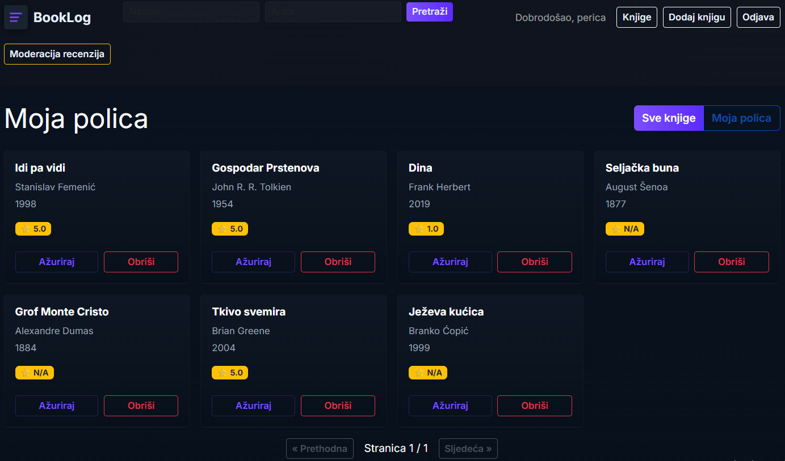

# BookLog

### 1. Kloniranje repozitorija (unutar `laragon/www/` direktorija nakon instalacije [Laragona](https://laragon.org/download))
```bash
git clone git@github.com:markosalai/BookLog.git
cd app
```
### 2. Kreiranje virtualnog okruženja i instaliranje paketa
```bash
python -m venv .venv
.\.venv\Scripts\activate # Windows
source .venv/bin/activate # MacOS i Linux
pip install -r requirements.txt
```
### 3. Postavljanje varijabli okruženja
Kreirati `.env` file i onda: 
```bash
cp .env.example .env
```
### 4. Kreiranje baze u Laragonu (HeidiSQL) - prazne baze pod nazivom `booklog`

### 5. Pokretanje migracija za inicijalizaciju baze
` python manage.py makemigrations `

` python manage.py migrate `

### 6. Pokretanje servera
` python manage.py runserver `

### Primjer knjižne polica korisnika




---
## API Dokumentacija

### Autentikacija

#### `POST /api/auth/register/`
Registracija novog korisnika.

**Body:**
```json
{
    "ime": "john",
    "email": "john@example.com",
    "password": "<password>"
}
```
**Odgovor `201`:**
```json
{
    "message": "Registracija uspješna",
    "user": { "id": 1, "ime": "john", "email": "john@example.com", "uloga": "user" },
    "access": "<access_token>",
    "refresh": "<refresh_token>"
}
```

---

#### `POST /api/auth/login/`
Prijava postojećeg korisnika.

**Body:**
```json
{
    "email": "john@example.com",
    "password": "<password>"
}
```
**Odgovor `200`:**
```json
{
    "message": "Prijava uspješna",
    "user": { "id": 1, "ime": "john", "email": "john@example.com", "uloga": "user" },
    "access": "<access_token>",
    "refresh": "<refresh_token>"
}
```

---

### Knjige

#### `GET /api/books/`
Lista svih knjiga s prosječnom ocjenom. Javni endpoint.

**Odgovor `200`:**
```json
{
    "books": [
        {
            "id": 1,
            "naslov": "Dune",
            "autor": "Frank Herbert",
            "isbn": "978-0-441-01359-7",
            "zanr": "Sci-Fi",
            "godina_izdanja": 1965,
            "prosjecna_ocjena": 4.5,
            "korisnik__ime": "john"
        }
    ]
}
```

---

#### `GET /api/books/moja-polica/`
Lista knjiga prijavljenog korisnika. Zahtijeva JWT.

**Odgovor `200`:** Isti format kao `GET /api/books/`.

---

#### `GET /api/books/{id}/`
Detalji knjige sa svim recenzijama. Javni endpoint.

**Odgovor `200`:**
```json
{
    "id": 1,
    "naslov": "Dune",
    "autor": "Frank Herbert",
    "isbn": "978-0-441-01359-7",
    "zanr": "Sci-Fi",
    "opis": "Epska sci-fi saga...",
    "godina_izdanja": 1965,
    "recenzije": [
        {
            "id": 1,
            "tekst": "Odlična knjiga!",
            "ocjena": 5,
            "vidljiva": true,
            "datum_pisanja": "2026-06-01",
            "korisnik__ime": "john",
            "korisnik_id": 1
        }
    ]
}
```

---

#### `POST /api/books/dodaj/`
Dodavanje nove knjige. Zahtijeva JWT.

**Body:**
```json
{
    "naslov": "Dune",
    "autor": "Frank Herbert",
    "isbn": "978-0-441-01359-7",
    "zanr": "Sci-Fi",
    "opis": "Epska sci-fi saga...",
    "godina_izdanja": 1965
}
```
**Odgovor `201`:**
```json
{
    "id": 1,
    "naslov": "Dune",
    "autor": "Frank Herbert",
    "isbn": "978-0-441-01359-7"
}
```
**Validacija:**
- `naslov` i `autor` — obavezni
- `isbn` — mora imati 10 ili 13 znakova
- `godina_izdanja` — mora biti između 1000 i 2026

---

#### `PUT /api/books/{id}/uredi/`
Uređivanje knjige. Zahtijeva JWT. Korisnik može uređivati samo svoje knjige.

**Body:** Isti format kao `POST /api/books/dodaj/`.

**Odgovor `200`:**
```json
{
    "id": 1,
    "naslov": "Dune",
    "autor": "Frank Herbert",
    "isbn": "978-0-441-01359-7"
}
```

---

#### `DELETE /api/books/{id}/obrisi/`
Brisanje knjige. Zahtijeva JWT. Korisnik može brisati samo svoje knjige.

**Odgovor `200`:**
```json
{ "message": "Knjiga obrisana" }
```

---

### Recenzije

#### `POST /api/books/{id}/reviews/`
Dodavanje recenzije na knjigu. Zahtijeva JWT. Jedan korisnik može ostaviti samo jednu recenziju po knjizi.

**Body:**
```json
{
    "tekst": "Odlična knjiga!",
    "ocjena": 5
}
```
**Odgovor `201`:**
```json
{
    "id": 1,
    "tekst": "Odlična knjiga!",
    "ocjena": 5
}
```
**Validacija:**
- `ocjena` — mora biti broj između 1 i 5

---

#### `DELETE /api/reviews/{id}/obrisi/`
Brisanje recenzije. Zahtijeva JWT. Korisnik može brisati samo svoje recenzije.

**Odgovor `200`:**
```json
{ "message": "Recenzija obrisana" }
```

---

### Admin rute

> Zahtijevaju JWT token korisnika s ulogom `admin`.

#### `GET /api/admin/reviews/`
Pregled svih recenzija svih korisnika. Samo admin.

**Odgovor `200`:**
```json
{
    "recenzije": [
        {
            "id": 1,
            "tekst": "Odlična knjiga!",
            "ocjena": 5,
            "vidljiva": true,
            "datum_pisanja": "2026-06-01",
            "korisnik__ime": "john",
            "korisnik__email": "john@example.com",
            "knjiga__naslov": "Dune"
        }
    ]
}
```

---

#### `PUT /api/admin/reviews/{id}/moderiraj/`
Toggleanje vidljivosti recenzije (`vidljiva = true/false`). Samo admin.

**Odgovor `200`:**
```json
{
    "id": 1,
    "vidljiva": false,
    "message": "Recenzija je sada skrivena"
}
```

---

### HTTP Status kodovi

| Kod | Značenje |
|---|---|
| `200` | Uspješan zahtjev |
| `201` | Resurs uspješno kreiran |
| `400` | Nevalidni podaci (greška validacije) |
| `401` | Token nije pronađen ili nije validan |
| `403` | Nedovoljne ovlasti (nije admin) |
| `404` | Resurs nije pronađen |
| `405` | HTTP metoda nije dozvoljena |
